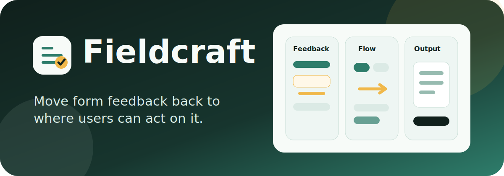

<p align="center">
  
</p>

<h1 align="center">Fieldcraft</h1>

<p align="center">
  Move form feedback back to where users can act on it.
</p>

<p align="center">
  <a href="LICENSE"></a>
  <a href="https://agentskills.io/"></a>
  
  
  
</p>

Fieldcraft is a small set of Agent Skills for reviewing form-heavy product
interfaces: setup flows, configuration generators, admin settings, onboarding
forms, and similar screens where feedback, preview, and final actions have to
stay close to the user's current decision.

## Why This Exists

Most frontend design skills focus on visual style, marketing pages, or a
specific component stack. Fieldcraft focuses on product UI craft:

- field-local validation and help
- form flow and progressive disclosure
- clear boundaries between input, preview, output, and actions
- browser-backed review when evidence is available
- source-only review with explicit confidence when no browser is available

## What Fieldcraft Checks

| Area | What it catches | Better shape |
|------|-----------------|--------------|
| Field feedback | Errors, warnings, and help text routed only to a global status area | Put the message next to the field or option that caused it |
| Form flow | Hidden-mode errors, unclear required fields, and disabled actions without reasons | Match guidance to the current choice and explain blockers locally |
| Output boundaries | Preview or status panels becoming the main place users discover mistakes | Keep output panels for generated files, commands, logs, and final actions |

## Related Tools

Fieldcraft is designed to work with, not compete with, mature tools:

- Playwright CLI or Playwright MCP for rendered browser evidence.
- Lighthouse, axe, WCAG-focused tooling, or web-quality skills for broader
  quality and accessibility audits.
- The project's own component library and design system for implementation.

## Install

| Agent | Support | Install |
|-------|---------|---------|
| Codex | Native `SKILL.md` | `cp -r skills/product-form-ux ~/.codex/skills/` |
| Claude Code | Native `SKILL.md` | `cp -r skills/product-form-ux ~/.claude/skills/` |
| OpenCode | Markdown review adapter | `cp adapters/opencode/product-form-ux.md ~/.config/opencode/agents/product-form-ux.md` |

Codex:

```bash
mkdir -p ~/.codex/skills
cp -r skills/product-form-ux ~/.codex/skills/
```

Claude Code:

```bash
mkdir -p ~/.claude/skills
cp -r skills/product-form-ux ~/.claude/skills/
```

OpenCode has a native Markdown agent format. Fieldcraft ships a review-focused
adapter for that path:

```bash
mkdir -p ~/.config/opencode/agents
cp adapters/opencode/product-form-ux.md ~/.config/opencode/agents/product-form-ux.md
```

The OpenCode adapter denies edits and asks before arbitrary shell commands. Use
it for review findings, then let your normal implementation agent make the
change.

## Use It

Ask your coding agent to use the skill during review or implementation:

```text
Use $product-form-ux to review this setup flow. Focus on validation placement,
disabled actions, and whether the preview/status panel is doing the right job.
```

## Skills

### `product-form-ux`

Use when building or reviewing a form-heavy product interface: a setup wizard,
configuration generator, admin settings surface, checkout-like flow, onboarding
form, or similar UI.

Then ask your coding agent to use `product-form-ux` when reviewing or changing a
form-heavy product UI.

## Boundaries

Fieldcraft is not:

- a visual preset pack
- a replacement for Playwright, Lighthouse, axe, or WCAG auditors
- a React, Tailwind, shadcn/ui, Leptos, or NixOS-specific workflow
- a guarantee of a particular visual style

Fieldcraft is a compact review protocol for product UI decisions around fields,
validation, previews, and final actions.

## Repository Shape

```text
skills/
  product-form-ux/
    SKILL.md
    agents/
      openai.yaml
    references/
      browser-review.md
      form-flow.md
      inline-feedback.md
      output-panel-boundaries.md
adapters/
  opencode/
    product-form-ux.md
assets/
  fieldcraft.svg
  fieldcraft.svg.prompt.md
  fieldcraft-banner.svg
  fieldcraft-banner.svg.prompt.md
```

## License

MIT
